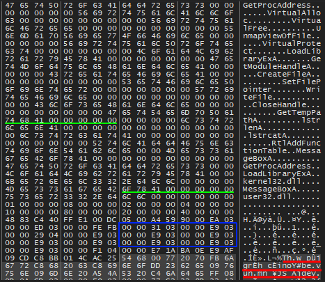

Unpacking CryptOne
==============
*Source*: **[Sanctions Be Damned | From Dridex to Macaw, The Evolution of Evil Corp](https://www.sentinelone.com/labs/sanctions-be-damned-from-dridex-to-macaw-the-evolution-of-evil-corp)**

*CrpytOne unpacked Data*: **[CryptOne_IOCs](https://github.com/SentineLabs/Crypt1_IOCs)**


\\


CryptOne unpacking method consists of two stages:
* Decrypts and executes embedded shellcode.
* Shellcode decrypts and executes embedded executable.

CryptOne gets chunks of the encrypted data which are separated by junks.


Example Memory Dump:
* **0x5EE00**, Encrypted size.
* **0x4011CA**, Address of encrypted data
* **0x4D/”M”**, Junk data 
* **0x14**, Junk size
* **0x7A**, Chunk Size 

\
After the removal of the junk data, the decryption starts with a simple XOR-Key which increases by 0x4 in each round. The initial XOR-Key is **0xA113**.


Once the shellcode is decrypted, we can partially observe _“This program cannot be run in DOS mode”_ where this data contains an executable which requires a second decryption. 



Similar to previous decryption, this time the shellcode decrypts the embedded binary.


The shellcode allocates and copies the encrypted executable and starts the decryption loop, once it finishes jumps to the EntryPoint and executes the unpacked sample.


At this stage we can observe strings related to the unpacked sample.


This is the unpacking process that the unpacker automates, providing the unpacked sample.

&nbsp;
#### CryptOne Yara Rule


```
rule CryptOne
{
  meta:
	Author = "@Tera0017/@SentinelOne"
	Family = "CryptOne Rule Versions from 2020/01 - 2021/06"
  strings:
	$x86_code1 = {68 FC 4A 06 00 68 F4 E0 01 00 E8}
	$x86_code2 = {6A 15 E8 [4] 83 C4 04 A3 [4] 68 45 7E 00 00}
	$x86_code3 = {83 C4 08 8B 55 ?? 8B 45 ?? 8D 8C 10 [4] 89}
	$x64_code1 = {C7 ?? ?? ?? 05 0D 00 00}
	$x64_code2 = {48 03 44 24 48 48 03 44 24 48 48 03 44 24 48 48 03 44 24 48}
	$x64_code3 = {41 8D 84 03 ?? ?? 00 00}
	$str1 = "\\{aa5b6a80-b834-11d0-932f-00a0c90dcaa9}"
	$str2 = "\\{b196b287-bab4-101a-b69c-00aa00341d07}"
  condition:
  	(all of ($x64*)) or (all of ($x86*))  or (any of ($str*) and (2 of ($x64*) or 2 of ($x86*)))
}
```
