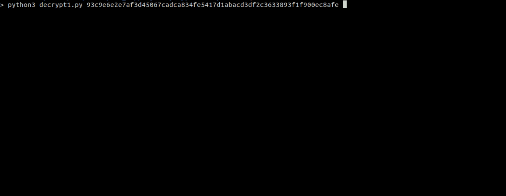

de-CryptOne
==============

Is a python 3 script which unpacks statically x86 & x64 samples packed with CryptOne packer versions from ~2020/01 until ~2021/04. This packer for a period of time was used also by EvilCorp.

\
*New CryptOne unpacker version [de-CryptOne v.2](https://github.com/Tera0017/de-CryptOne-v2). (~2021/04 until ~now)*


### Usage

```
~$ python3 decrypt1.py sample.bin
```

&nbsp;
#### Example



&nbsp;
#### Requirements (Latest tested)

* Yara, Version 3.9.0
* yara-python, Version 4.1.0
* pefile, Version 2021.5.24

&nbsp;
### CryptOne unpacking

Unpacking old version of CryptOne step by step, [CryptOne Unpacking](https://github.com/Tera0017/de-CryptOne/blob/main/CryptOne_Unpacking.md).

&nbsp;
### Support

In case some files are not working, please make sure it is packed with CryptOne, if yes please provide me the hash in a DM ([@Tera0017](https://twitter.com/tera0017)).

Regards
